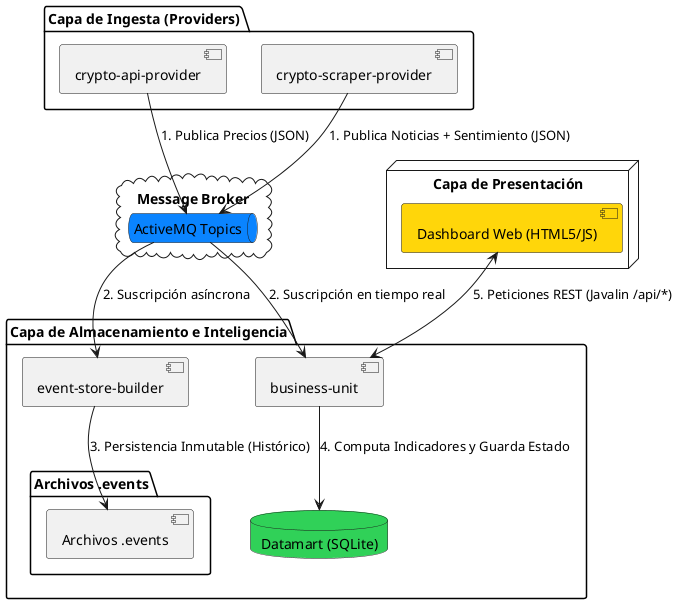

# Market Intelligence: Crypto Analytics Platform

Plataforma corporativa de inteligencia de mercado basada en una Arquitectura Orientada a Eventos bajo el patrón Kappa. El sistema automatiza la ingesta, normalización y cruce analítico de flujos masivos de cotizaciones financieras y análisis cualitativo de sentimiento de noticias, consolidando una capa de datos de baja latencia para la emisión de señales de inversión en tiempo real.

## 1. Propuesta de Valor y Funcionalidad de Negocio

El objetivo crítico de esta plataforma es resolver la asimetría informativa en el ecosistema de activos digitales a través del procesamiento analítico unificado. El sistema procesa de forma concurrente variables cuantitativas de mercado y factores cualitativos de opinión pública para computar una Señal de Mercado determinista: Favorable, Neutral o Riesgoso.

El valor algorítmico del sistema radica en la correlación multidimensional de:
* Métricas Cuantitativas: Desviación típica del precio (volatilidad intrínseca dentro de ventanas de tiempo horarias), volumen de transacciones de las últimas 24 horas y ratio de liquidez (proporción entre capitalización de mercado y volumen operativo).
* Métricas Cualitativas: Densidad del flujo informativo sectorial y catalogación semántica del sentimiento agregado mediante Procesamiento de Lenguaje Natural (NLP).

Esta aproximación permite la detección predictiva de escenarios de inestabilidad, tales como Alertas de Hype (coincidencia de alta volatilidad con anomalías en el volumen de noticias) y correcciones severas por sentimiento de mercado adverso.

---

## 2. Justificación Tecnológica y de Arquitectura de Datos

### Selección de APIs e Ingesta
* CoinGecko REST API: Seleccionada por su alta precisión institucional en la agregación de métricas de mercado (precios ponderados, capitalizaciones distribuidas y volúmenes globales de negociación de 24 horas), garantizando la fiabilidad de la capa cuantitativa sin requerir sobrecostes de autenticación en entornos distribuidos.
* CoinDesk RSS Feed y ApiNinjas NLP: La ingesta de noticias se realiza a través de flujos sindicados estructurados. El análisis de sentimiento se delega en servicios basados en modelos lingüísticos avanzados que evalúan el sesgo del texto (Bearish/Bullish) traduciéndolo a puntuaciones numéricas continuas entre -1.0 y 1.0, eliminando la carga operativa de desplegar modelos locales de Deep Learning.

### Estructura y Justificación del Datamart
Se ha seleccionado SQLite como motor de persistencia analítica (Datamart). Al tratarse de una arquitectura Kappa donde la computación de vistas ocurre de manera continua sobre flujos de eventos, SQLite ofrece un almacenamiento local serverless de latencia ultrabaja, con transacciones ACID nativas. Esto optimiza los tiempos de respuesta del servidor de aplicaciones al consultar estructuras precalculadas en lugar de agregar bases de datos distribuidas en cada petición REST.

El Datamart está compuesto por cuatro tablas normalizadas y altamente optimizadas:
* `crypto_timeline`: Registra el histórico de precios de cierre, mínimos y máximos por ventana temporal horaria y activo, permitiendo evaluar la dispersión de precios en tiempo real.
* `news_feed`: Almacena el registro crudo indexado de noticias publicadas, sus URLs de procedencia y las etiquetas de sentimiento asociadas.
* `market_hype_alerts`: Consolida las agregaciones temporales del volumen de impactos informativos y la puntuación de sentimiento promedio.
* `market_signal`: Almacena el estado analítico resultante del algoritmo de negocio para la lectura directo del cliente web.

---

## 3. Arquitectura del Sistema y de la Aplicación

El sistema se basa en un desacoplamiento completo mediado por un Message Broker, siguiendo un modelo de pipeline inmutable.

### Arquitectura de Sistema (Componentes Globales)
El flujo de datos se propaga de forma asíncrona desde las fuentes externas hasta el consumidor final.


### Arquitectura de la Aplicación por Módulos
Cada componente responde a un propósito específico dentro del ciclo de desarrollo del proyecto:

#### Capa de Ingesta: Crypto API Provider
Módulo encargado del sondeo periódico de las métricas numéricas del mercado y su inmediata conversión a mensajes JSON estandarizados en el broker.


#### Capa de Ingesta: Crypto Scraper Provider
Módulo diseñado bajo los estándares estrictos de la Arquitectura Hexagonal (Puertos y Adaptadores). Separa la lógica de negocio pura (Domain) de las implementaciones externas de red y publicación (Infrastructure).


#### Capa de Almacenamiento: Event Store Builder
Actúa como la fuente de verdad inmutable del sistema. Captura de forma independiente cada mensaje de ActiveMQ y lo escribe de manera secuencial en archivos planos locales `.events`, posibilitando la auditoría completa y la reconstrucción histórica del Datamart ante fallos catastróficos.


#### Capa de Negocio y Presentación: Business Unit
Consumidor central del sistema que unifica los flujos asíncronos. Computa los ratios matemáticos, actualiza el estado del Datamart y expone la API REST mediante un servidor Javalin.


---

## 4. Principios y Patrones de Diseño Aplicados

* Arquitectura Kappa (Inmutabilidad de Eventos): Los datos nunca se sobrescriben en la capa de almacenamiento. Toda la información histórica y actual se trata como un log secuencial de eventos distribuidos, asegurando la reproducibilidad total del estado de la aplicación.
* Puertos y Adaptadores (Arquitectura Hexagonal): Implementado con rigor en el módulo Scraper. Las interfaces `NewsFeeder` y `SentimentAnalyzer` actúan como los puertos de entrada de la lógica de negocio; las implementaciones tecnológicas como `CoinDeskFeeder` o `ApiNinjasAnalyzer` se ubican exclusivamente en la periferia (Infrastructure), garantizando que un cambio en las APIs externas no afecte al núcleo del sistema.
* Patrón Publicador-Suscriptor (Temporal y Spatial Decoupling): La integración mediante Apache ActiveMQ permite que los módulos emisores ignoren por completo la existencia, ubicación y estado de ejecución de los módulos consumidores, confiriendo tolerancia a fallos y escalabilidad elástica al sistema.
* Data Mapper Pattern: Clases especializadas (`CryptoPriceMapper`, `NewsEventMapper`) realizan de forma aislada la transformación de los payloads externos de red en entidades fuertemente tipadas del modelo de dominio.

---

## 5. Archivos de Configuración y Despliegue

### Configuración del Ciclo de Vida del Proyecto (POM Raíz)
El proyecto gestiona la compilación multi-módulo y la generación automatizada de diagramas técnicos mediante la siguiente especificación de Maven:

```xml
<?xml version="1.0" encoding="UTF-8"?>
<project xmlns="[http://maven.apache.org/POM/4.0.0](http://maven.apache.org/POM/4.0.0)"
         xmlns:xsi="[http://www.w3.org/2001/XMLSchema-instance](http://www.w3.org/2001/XMLSchema-instance)"
         xsi:schemaLocation="[http://maven.apache.org/POM/4.0.0](http://maven.apache.org/POM/4.0.0) [http://maven.apache.org/xsd/maven-4.0.0.xsd](http://maven.apache.org/xsd/maven-4.0.0.xsd)">
    <modelVersion>4.0.0</modelVersion>

    <groupId>es.ulpgc.datos</groupId>
    <artifactId>crypto-watcher</artifactId>
    <version>1.0-SNAPSHOT</version>
    <packaging>pom</packaging>
    
    <modules>
        <module>crypto-api-provider</module>
        <module>crypto-scraper-provider</module>
        <module>event-store-builder</module>
        <module>business-unit</module>
    </modules>

    <properties>
        <maven.compiler.source>21</maven.compiler.source>
        <maven.compiler.target>21</maven.compiler.target>
        <project.build.sourceEncoding>UTF-8</project.build.sourceEncoding>
    </properties>

    <build>
        <plugins>
            <plugin>
                <artifactId>plantuml-generator-maven-plugin</artifactId>
                <groupId>de.elnarion.maven</groupId>
                <version>3.0.1</version>
                <executions>
                    <execution>
                        <id>generate-class-diagram</id>
                        <goals>
                            <goal>generate</goal>
                        </goals>
                        <phase>generate-test-sources</phase>
                        <configuration>
                            <outputFilename>diagrama-clases.puml</outputFilename>
                            <outputDirectory>${project.basedir}/diagrams</outputDirectory>
                            <scanPackages>
                                <scanPackage>es.ulpgc.datos</scanPackage>
                            </scanPackages>
                            <hideMethods>true</hideMethods>
                        </configuration>
                    </execution>
                </executions>
            </plugin>
        </plugins>
    </build>
</project>

```

### Requisitos Previos y Variables de Entorno

Para el correcto despliegue del sistema es indispensable contar con:

1. Java Development Kit (JDK) versión 21.
2. Apache ActiveMQ instalado y en ejecución en su puerto nativo (`tcp://localhost:61616`).
3. Clave de API válida para la normalización del texto, configurada en el entorno del sistema operativo:
* En sistemas Unix/macOS: `export API_NINJAS_KEY="tu_clave_secreta"`
* En sistemas Windows (CMD): `set API_NINJAS_KEY="tu_clave_secreta"`


### Instrucciones de Compilación y Ejecución

Compilación global del ciclo de vida del proyecto:

```bash
mvn clean install

```

Para forzar la generación de los diagramas de clases PlantUML de todos los módulos:

```bash
mvn generate-test-sources

```

Orden secuencial de inicio de los componentes:

1. Iniciar el broker de mensajería (ActiveMQ).
2. Arrancar el persistidor de eventos ejecutando la clase principal del módulo `event-store-builder`.
3. Levantar la capa de lógica analítica e interfaz arrancando el `Main` del módulo `business-unit`.
4. Iniciar los procesos de extracción de datos ejecutando los `Main` correspondientes en los módulos `crypto-api-provider` y `crypto-scraper-provider`.

---

## 6. Muestras de Datos del Event Store

A continuación se exponen registros reales de las estructuras inmutables persistidas secuencialmente por el sistema dentro de la arquitectura de logs.

### Eventos Semánticos de Noticias Cuantitativas (Módulo Scraper)

```json
{"ts":"2026-04-13T17:44:25.251211400Z","ss":"CoinDeskScraper","title":"Latest Videos","url":"[https://www.coindesk.com/videos](https://www.coindesk.com/videos)"}
{"ts":"2026-04-13T17:44:25.253611400Z","ss":"CoinDeskScraper","title":"Latest Crypto News","url":"[https://www.coindesk.com/latest-crypto-news](https://www.coindesk.com/latest-crypto-news)"}
{"ts":"2026-04-13T17:44:25.254612700Z","ss":"CoinDeskScraper","title":"Crypto exchange Kraken targeted in extortion attempt but says there was no breach and no client funds at risk","url":"[https://www.coindesk.com/business/2026/04/13/crypto-exchange-kraken-targeted-in-extortion-attempt-but-says-there-was-no-breach-and-no-client-funds-at-risk](https://www.coindesk.com/business/2026/04/13/crypto-exchange-kraken-targeted-in-extortion-attempt-but-says-there-was-no-breach-and-no-client-funds-at-risk)"}
{"ts":"2026-04-13T17:44:25.255611400Z","ss":"CoinDeskScraper","title":"Bitcoin moves off lowest levels as worst of weekend fears slip away","url":"[https://www.coindesk.com/markets/2026/04/13/bitcoin-moves-off-lowest-level-as-worst-of-weekend-fears-slip-away](https://www.coindesk.com/markets/2026/04/13/bitcoin-moves-off-lowest-level-as-worst-of-weekend-fears-slip-away)"}

```

### Eventos Métricos de Cotizaciones de Mercado (Módulo API)

```json
{"ts":"2026-04-29T18:45:00.135831200Z","ss":"crypto-api-provider","coinId":"bitcoin","symbol":"btc","name":"Bitcoin","priceUsd":75291.0,"marketCap":1.507497696769E12,"volume24h":4.135959577E10}
{"ts":"2026-04-29T18:45:00.135831200Z","ss":"crypto-api-provider","coinId":"ethereum","symbol":"eth","name":"Ethereum","priceUsd":2227.27,"marketCap":2.68997571248E11,"volume24h":1.7764855403E10}

```


## 7. Muestras de Datos del Datamart

#### Tabla: crypto_timeline
| time_window | coin_id | close_price | min_price | max_price | volume_24h | market_cap |
| :--- | :--- | :--- | :--- | :--- | :--- | :--- |
| 2026-05-19 12:00 | ethereum | 2227.27 | 2225.00 | 2230.10 | 1.7764E10 | 2.6899E11 |
| 2026-05-19 12:00 | bitcoin | 75291.00 | 75100.00 | 75450.00 | 4.1359E10 | 1.5074E12 |

#### Tabla: market_signal
| time_window | coin_id | volatility_ratio | signal | hype_warning |
| :--- | :--- | :--- | :--- | :--- |
| 2026-05-19 12:00 | ethereum | 0.0022 | Neutral | 0 |
| 2026-05-19 12:00 | bitcoin | 0.0046 | Favorable | 0 |

#### Tabla: market_hype_alerts
| time_window | coin_id | news_volume | average_sentiment_score | is_high_volatility | hype_warning |
| :--- | :--- | :--- | :--- | :--- | :--- |
| 2026-05-19 12:00 | __global__ | 50 | 0.02 | 0 | 0 |

#### Tabla: news_feed
| published_at | title | url | sentiment_label |
| :--- | :--- | :--- | :--- |
| 2026-04-13T17:44:25Z | Crypto exchange Kraken targeted in extortion attempt | https://www.coindesk.com/business/kraken | NEGATIVO |
| 2026-04-13T17:44:25Z | Bitcoin moves off lowest levels as weekend fears slip | https://www.coindesk.com/markets/btc | POSITIVO |

---

## 8. Interfaz REST y Ejemplos de Peticiones

La capa de presentación de la `business-unit` expone servicios web estructurados en formato JSON bajo el puerto base `8080`.

### Endpoints Disponibles y Estructura de Consulta

#### 1. Obtención de Criptomonedas Activas

* Verbo: `GET`
* URL: `http://localhost:8080/api/coins`
* Respuesta:

```json
["bitcoin", "ethereum"]

```

#### 2. Resumen Consolidado de Señal de Negocio

* Verbo: `GET`
* URL: `http://localhost:8080/api/summary?coin=ethereum`
* Respuesta:

```json
{
  "coinId": "ethereum",
  "signal": "Neutral",
  "volatilityRatio": 0.0045,
  "volatilityLevel": "Baja",
  "hypeWarning": false,
  "newsVolume": 50,
  "averageSentimentScore": 0.02,
  "sentimentLabel": "Neutral",
  "volume_24h": 1.7764855403E10,
  "market_cap": 2.68997571248E11
}

```

#### 3. Histórico de Ventanas Temporales

* Verbo: `GET`
* URL: `http://localhost:8080/api/timeline?coin=ethereum`
* Respuesta:

```json
[
  {
    "time_window": "2026-05-19 12:00",
    "close_price": 2227.27,
    "max_price": 2230.10,
    "min_price": 2225.00
  }
]

```

---

## 9. Apéndice: Especificaciones Técnicas PlantUML

Para permitir la edición y el mantenimiento de los diagramas, se adjuntan las especificaciones textuales del sistema.

### Código del Diagrama de Arquitectura Global


