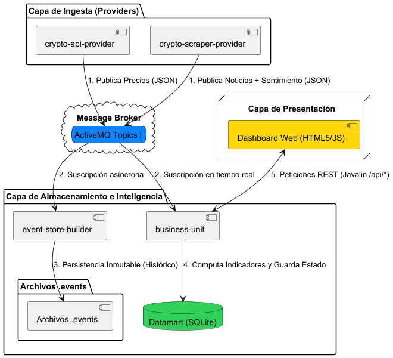
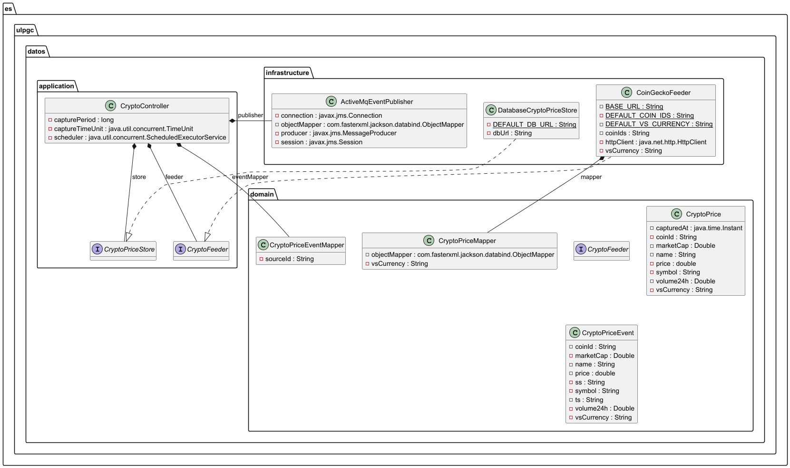
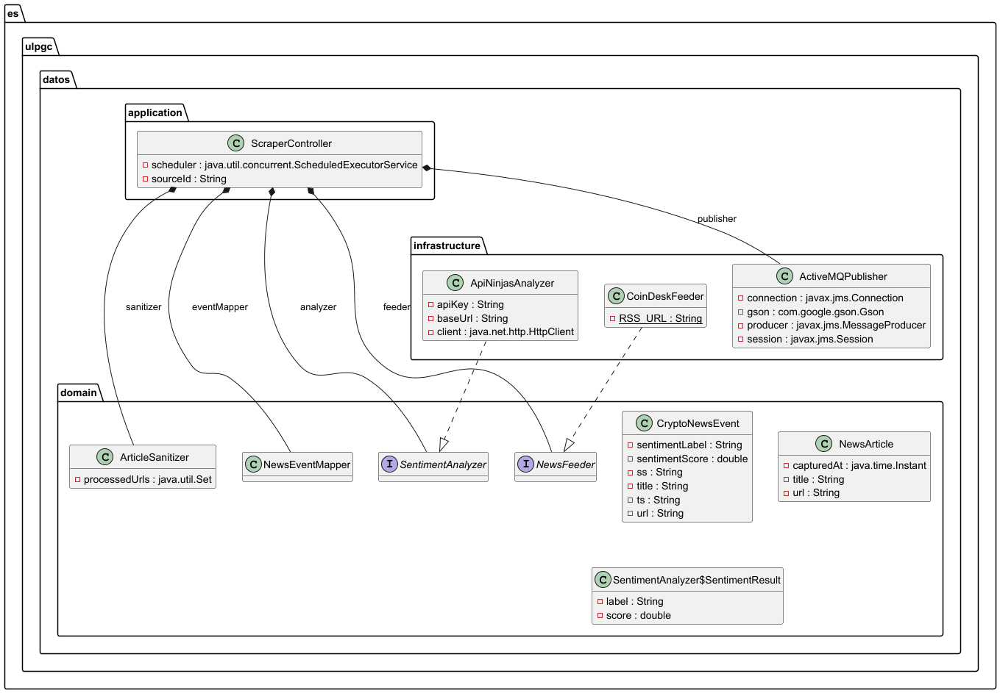
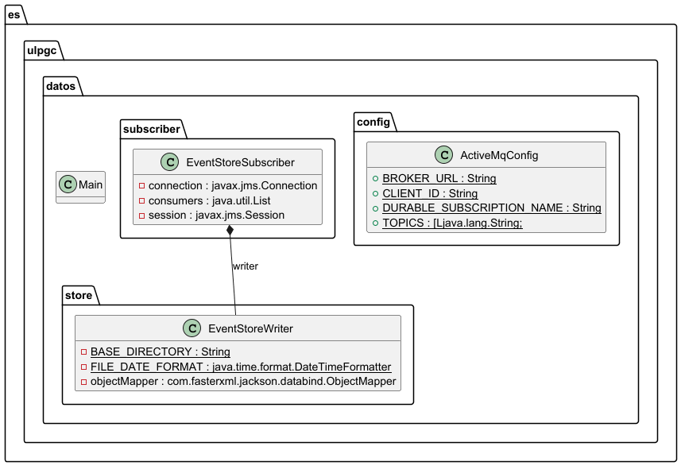
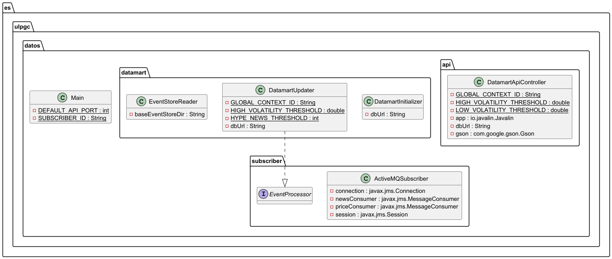

# Market Intelligence: Crypto Analytics Platform

Plataforma de inteligencia de mercado basada en una **Arquitectura Orientada a Eventos (Kappa)**. El sistema ingiere, procesa y cruza datos de cotizaciones de criptomonedas y análisis de sentimiento de noticias financieras para ofrecer señales de inversión en tiempo real.

## 🎯 Objetivo de la Funcionalidad de Negocio

El objetivo principal de esta plataforma es resolver la asimetría de información en el mercado de criptomonedas proporcionando al usuario una **Señal de Mercado accionable (Favorable, Neutral o Riesgoso)**. 

Para lograrlo, el sistema abandona el análisis de precios aislado y ejecuta un cruce de datos en tiempo real entre:
1. **Métricas cuantitativas:** Volatilidad del precio, Volumen 24H y Ratio de Liquidez (Capitalización vs Volumen).
2. **Métricas cualitativas:** Volumen de impacto mediático y análisis de sentimiento (Bearish/Bullish) procesado mediante Procesamiento de Lenguaje Natural (NLP).

Esta combinación permite detectar de forma automatizada **Alertas de Hype** (euforia o pánico irracional), movimientos silenciosos de "ballenas" y momentos de alta tensión operativa.

---

## 🏗️ Arquitectura Global del Sistema

El proyecto está diseñado bajo los principios de **Clean Architecture (Puertos y Adaptadores)** para garantizar el desacoplamiento, dividiéndose en módulos independientes comunicados de forma asíncrona a través de Apache ActiveMQ.

---

## 🧩 Componentes y Diagramas de Clases

### 1. Capa de Ingesta: Crypto API Provider
Extrae cotizaciones (Precio, Volumen, Market Cap) desde la API REST de CoinGecko y las publica en el bus de mensajería.

### 2. Capa de Ingesta: Crypto Scraper Provider
Ingiere el feed RSS oficial de CoinDesk, limpia el contenido (Sanitizer) y evalúa el sentimiento usando la API de ApiNinjas. Implementa una separación estricta entre Dominio, Aplicación e Infraestructura.

### 3. Capa de Almacenamiento: Event Store Builder
Persiste todos los eventos crudos (`.events`) emitidos por los providers, garantizando la inmutabilidad de los datos y permitiendo la reconstrucción del estado del sistema desde cero.

### 4. Capa de Negocio y Presentación: Business Unit
Escucha los mensajes en tiempo real, actualiza el Datamart (SQLite) consolidando indicadores complejos, y levanta un servidor REST con **Javalin** para alimentar el Dashboard SPA interactivo.

---

## 🚀 Cómo ejecutar y probar el sistema (Demo)

Para levantar la arquitectura End-to-End (E2E) y visualizar el flujo en tiempo real frente a los eventos históricos, sigue estos pasos:

### Prerrequisitos
* Java 21 o superior y Maven.
* Apache ActiveMQ ejecutándose localmente en el puerto `61616`.
* Variable de entorno configurada: `API_NINJAS_KEY` con tu clave de acceso.

### Orden de Ejecución (Arranque en Frío)

1. **Limpiar estado (Opcional pero recomendado para demos):** Borra el archivo `datamart.db` en el módulo `business-unit` para forzar la reconstrucción histórica.
2. **Iniciar el Broker:** Asegúrate de que Apache ActiveMQ está arrancado.
3. **Iniciar Event Store:** Ejecuta el `Main` del módulo `event-store-builder` para habilitar el guardado y lectura del historial.
4. **Iniciar la Business Unit:** Ejecuta el `Main` de `business-unit`. Verás en consola cómo lee instantáneamente los archivos `.events` históricos y reconstruye la base de datos completa.
5. **Iniciar el flujo en Tiempo Real (Providers):**
    * Ejecuta el `Main` de `crypto-api-provider`.
    * Ejecuta el `Main` de `crypto-scraper-provider`.
6. **Interactuar con la Interfaz:**
    * Abre tu navegador web y navega a: [http://localhost:8080](http://localhost:8080)
    * Observa cómo se dibujan las gráficas con el histórico y cómo se actualizan dinámicamente los paneles de liquidez, el termómetro de sentimiento y la señal de mercado cada vez que los scrapers publican nueva información.
